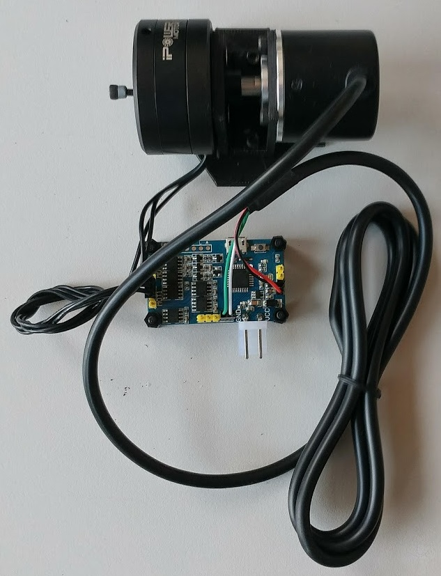

# Arduino FOC library 
### Arduino Field Oriented Control (FOC) for gimbal BLDC motors


[](https://opensource.org/licenses/MIT)

Proper low cost FOC supporting boards are very hard to find these days and even may not exist. The reason may be that the hobby community has not yet dug into it properly. Therefore this is the attempt to demistify the Field Oriented Control (FOC) algorithm and make a robust but simple implementation for usage with Arduino hadrware.

#### This project aims to close the gap in the areas:
- Low cost applications <50$
- Low current operation < 5A
- Simple usage and scalability (Arduino)
 and demistify FOC control in a simple way. 


#### The closest you can get to FOC support and low cost (I was able to find) is:

<a href="https://odriverobotics.com/" >Odroid</a> | <a href="https://www.youtube.com/watch?v=g2BHEdvW9bU">Trinamic</a>
------------ | -------------
 | 
:heavy_check_mark: Open Source | :x: Open Source
:heavy_check_mark:Simple to use | :heavy_check_mark: Simple to use
:x: Low cost | :x: Low cost
:x: Low power | :heavy_check_mark: Low cost

<a href="https://www.infineon.com/cms/en/product/evaluation-boards/bldc_shield_tle9879/" >Infineon</a> | <a href="https://github.com/gouldpa/FOC-Arduino-Brushless">FOC-Arduino-Brushless</a>
------------ | -------------
| 
:x: Open Source | :heavy_check_mark: Open Source
:heavy_check_mark:Simple to use | :x: Simple to use
:heavy_check_mark:Low cost | :heavy_check_mark: Low cost
:heavy_check_mark:  Low power | :heavy_check_mark: Low cost


## All you need for this project is (an exaple in brackets):
 - Brushless DC motor - 3 pahse    (IPower GBM4198H-120T [Ebay](https://www.ebay.com/itm/iPower-Gimbal-Brushless-Motor-GBM4108H-120T-for-5N-7N-GH2-ILDC-Aerial-photo-FPV/252025852824?hash=item3aade95398:g:q94AAOSwPcVVo571:rk:2:pf:1&frcectupt=true))
 - Encoder - ( Incremental 2400cpr [Ebay](https://www.ebay.com/itm/600P-R-Photoelectric-Incremental-Rotary-Encoder-5V-24V-AB-2-Phases-Shaft-6mm-New/173145939999?epid=19011022356&hash=item28504d601f:g:PZsAAOSwdx1aKQU-:rk:1:pf:1))
- Arduino + BLDC motor driver ( L6234 driver [Drotek](https://store-drotek.com/212-brushless-gimbal-controller-l6234.html), [Ebay](https://www.ebay.fr/itm/L6234-Breakout-Board-/153204519965))

Alternatively the library supports the arduino based gimbal controllers such as:
- HMBGC V2.2 ([Ebay](https://www.ebay.com/itm/HMBGC-V2-0-3-Axle-Gimbal-Controller-Control-Plate-Board-Module-with-Sensor/351497840990?hash=item51d6e7695e:g:BAsAAOSw0QFXBxrZ:rk:1:pf:1))
 
# Using the library
## Conneciton of encoder and motor 

### Arduino FOC Shield v1.1


### Arduino UNO + L6234 breakout broad
The code is simple enough to be ran on Arudino Uno board. 

<p>
 
</p>  

#### Encoder
- Encoder channels `A` and `B` are connected to the Arduino's external intrrupt pins `2` and `3`. 
- Optionally if your encoder has `index` signal you can connect it to any available pin, figure shows pin `4`.  
		- The library doesnt support the Index pin for now (version v1.1.0)
#### L6234 breakout board 
- Connected to the arduino pins `9`,`10` and `11`. 
- Additionally you can connect the `enable` pin to the any digital pin of the arduino the picture shows pin `8` but this is optional. You can connect the driver enable directly to 5v. 
- Make sure you connect the common ground of the power supply and your Arduino
##### Motor
- Motor phases `a`, `b` and `c` are connected directly to the driver outputs

Motor phases `a`,`b`,`c` and encoder channels `A` and `B` have to be oriented right for the algorightm to work. But don't worry about it too much. Connect it in initialy as you wish and then if it doesnt move reverse pahse `a` and `b` of the motor, that should be enogh.


### HMBGC V2.2
To use HMBGC controller for vector control (FOC) you need to connect motor to one of the motor terminals and connect the Encoder. The shema of connection is shown on the figures above, I also took a (very bad) picture of my setup.

<p>
	
	
</p>
 
 
#### Encoder
Since HMBGC doesn't have acces to the arduinos external interrupt pins `2` and `3` and additionally we only have acces to the analog pins, we need to read the encoder using the software interrupt. To show the functionallity we provide one example of the HMBGC code (`HMBGC_example.ino`) using the [PciManager library](https://github.com/prampec/arduino-pcimanager).

- Encoder channels `A` and `B` are connected to the pins `A0` and `A1`.
- Optionally if your encoder has `index` signal you can connect it to any available pin, figure shows pin `A2`.  
		- The library doesnt support the Index pin for now (version v1.1.0)
#### Motor
- Motor phases `a`,`b` and `c` are connected directly to the driver outputs

Motor phases `a`,`b`,`c` and encoder channels `A` and `B` have to be oriented right for the algorightm to work. But don't worry about it too much. Connect it in initialy as you wish and then if it doesnt move reverse pahse `a` and `b` of the motor, that should be enogh.


## The code
The code is organised into a librarie. The library contains two classes `BLDCmotor` and `Endcoder`. `BLDCmotor` contains all the necessary FOC algorithm funcitons as well as PI controllers for the velocity and angle control.  `Encoder`  deals with the encoder interupt funcitons, calcualtes motor angle and velocity( using the [Mixed Time Frequency Method](https://github.com/askuric/Arduino-Mixed-Time-Frequency-Method)).

### Initialization
#### Motor initialisaiton:
To intialise the motor you need to input the `pwm` pins, number of `pole pairs` and optionally driver `enable` pin.
```cpp
//  BLDCMotor( int phA, int phB, int phC, int pp, int en)
//  - phA, phB, phC - motor A,B,C phase pwm pins
//  - pp            - pole pair number
//  - enable pin    - (optional input)
BLDCMotor motor = BLDCMotor(9, 10, 11, 11, 8);
```
#### Encoder intiialisation
To initialise the encoder you need to provide the encoder `A` and `B` channel pins, encoder `CPR` and optionally `index` pin.

```cpp
//  Encoder(int encA, int encB , int cpr, int index)
//  - encA, encB    - encoder A and B pins
//  - ppm           - impulses per rotation 
//  - index pin     - (optional input)
Encoder encoder = Encoder(2, 3, 32768, 4);
```

### Parametrisation
```cpp
// encoder initialise hardware pins
// Pullup::EXTERN - external pullup added
// Pullup::INTERN - needs internal arduino pullup
encoder.init(Pullup::EXTERN);
```

```cpp
// interupt intitialisation
// A callback and B callback
attachInterrupt(digitalPinToInterrupt(encoder.pinA), []() {
encoder.handleA();
}, CHANGE);
attachInterrupt(digitalPinToInterrupt(encoder.pinB), []() {
encoder.handleB();
}, CHANGE);
```

### Usage in loop

I have not made an implementation using timer intrupts just yet, but it is one of the future steps. 
At the motment the function control loop function has to be iteratively called in the `loop()`.

## Control loops
There are three cascade control loops implemented in the library:
### Open loop voltage Uq
Using the fucntion 
```cpp
motor.setPhaseVoltage(float Uq)
```
you can run BLDC motor as it is DC motor using Park transformation.

### Closed loop velocity control
Using the fucntion 
```cpp 
motor.setVelocity(float v)
```
you can run BLDC motor in closed loop with desired velocity.

### Closed loop position control
Using the fucntion 
```cpp
motor.setPosition(float pos)
```
you can run BLDC motor in closed loop with desired position.

