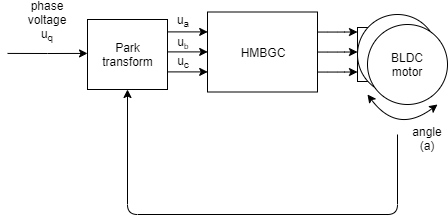
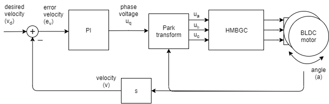
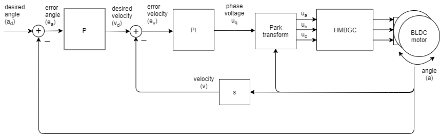

# ArduinoFOC library 
### Arduino Field Oriented Control (FOC) for gimbal BLDC motors


[](https://opensource.org/licenses/MIT)

Proper low cost FOC supporting boards are very hard to find these days and even may not exist. The reason may be that the hobby community has not yet dug into it properly. Therefore this is the attempt to demistify the Field Oriented Control (FOC) algorithm and make a robust but simple implementation for usage with Arduino hadrware.

#### This project aims to close the gap in the areas:
- Low cost applications <50$
- Low current operation < 5A
- Simple usage and scalability (Arduino)
 and demistify FOC control in a simple way. 


#### The closest you can get to FOC support and low cost (I was able to find) is:

<a href="https://odriverobotics.com/" >Odroid</a> | <a href="https://www.youtube.com/watch?v=g2BHEdvW9bU">Trinamic</a>
------------ | -------------
 | 
:heavy_check_mark: Open Source | :x: Open Source
:heavy_check_mark:Simple to use | :heavy_check_mark: Simple to use
:x: Low cost | :x: Low cost
:x: Low power | :heavy_check_mark: Low cost

<a href="https://www.infineon.com/cms/en/product/evaluation-boards/bldc_shield_tle9879/" >Infineon</a> | <a href="https://github.com/gouldpa/FOC-Arduino-Brushless">FOC-Arduino-Brushless</a>
------------ | -------------
 | 
:x: Open Source | :heavy_check_mark: Open Source
:heavy_check_mark:Simple to use | :x: Simple to use
:heavy_check_mark:Low cost | :heavy_check_mark: Low cost
:heavy_check_mark:  Low power | :heavy_check_mark: Low cost


## All you need for this project is (an exaple in brackets):
 - Brushless DC motor - 3 pahse    (IPower GBM4198H-120T [Ebay](https://www.ebay.com/itm/iPower-Gimbal-Brushless-Motor-GBM4108H-120T-for-5N-7N-GH2-ILDC-Aerial-photo-FPV/252025852824?hash=item3aade95398:g:q94AAOSwPcVVo571:rk:2:pf:1&frcectupt=true))
 - Encoder - ( Incremental 2400cpr [Ebay](https://www.ebay.com/itm/600P-R-Photoelectric-Incremental-Rotary-Encoder-5V-24V-AB-2-Phases-Shaft-6mm-New/173145939999?epid=19011022356&hash=item28504d601f:g:PZsAAOSwdx1aKQU-:rk:1:pf:1))
- Arduino + BLDC motor driver ( L6234 driver [Drotek](https://store-drotek.com/212-brushless-gimbal-controller-l6234.html), [Ebay](https://www.ebay.fr/itm/L6234-Breakout-Board-/153204519965))

Alternatively the library supports the arduino based gimbal controllers such as:
- HMBGC V2.2 ([Ebay](https://www.ebay.com/itm/HMBGC-V2-0-3-Axle-Gimbal-Controller-Control-Plate-Board-Module-with-Sensor/351497840990?hash=item51d6e7695e:g:BAsAAOSw0QFXBxrZ:rk:1:pf:1))
 
# Using the library
## Conneciton of encoder and motor 

### Arduino FOC Shield v1.1


### Arduino UNO + L6234 breakout broad
<p>
	
</p>

### HMBGC V2.0
<p>
	
</p>
To use HMBGC controller for vector control (FOC) you need to connect motor to one of the motor terminals and connect the Encoder. The shema of connection is shown on the figures above, I also took a (very bad) picture of my setup. 

## The code
The code is organised in two libraries, BLDCmotor.h and endcoder.h. BLDCmotor.h contains all the necessary FOC funciton implemented and encoder.h  deals with the encoder. I will make this better in future. :D

### Initialization
The heart of the init is the constructor call:
```cpp
BLDCMotor motor = BLDCMotor(9,10,11,&counter[ENCODER_1],A0,A1,11,2400);
//BLDCMotorint(phA, phB, phC, long* counter, int encA, int encB , int pp, int cpr)
```
The first three arguments are pin numbers of them motor phases, either 9,10,11 or 6,5,3
Fourth argument is a pointer to the encoder counter
Fith and sixt argument are encoder pins channel A and channel B
Seventh argument is number of Pole pairs of the motor
And Eight argument is the cpr of the encoder

### Usage in loop

I have not made an implementation using timer intrupts just yet, but it is one of the future steps. 
At the motment the function control loop function has to be iteratively called in the `loop()`.

## Control loops
There are three cascade control loops implemented in the library:
### Open loop voltage Uq
Using the fucntion 
```cpp
motor.setPhaseVoltage(float Uq)
```
you can run BLDC motor as it is DC motor using Park transformation.

### Closed loop velocity control
Using the fucntion 
```cpp 
motor.setVelocity(float v)
```
you can run BLDC motor in closed loop with desired velocity.

### Closed loop position control
Using the fucntion 
```cpp
motor.setPosition(float pos)
```
you can run BLDC motor in closed loop with desired position.

