# Arduino Simple Field Oriented Control (FOC) library 


[](https://opensource.org/licenses/MIT)
[](https://www.ardu-badge.com/badge/Simple%20FOC.svg)

Proper low cost FOC supporting boards are very hard to find these days and even may not exist. The reason may be that the hobby community has not yet dug into it properly. But even if you would find a hardware which is capable of runing BLDC motors, a good FOC code capable of running on Arduino devices is even harder to find. Therefore this is the attempt to ***demistify the Field Oriented Control (FOC) algorithm*** and make a ***robust but simple implementation*** for ***Arduino hadrware***, as well as to introduce the new [Arduino FOC shield board](https://askuric.github.io/simplefoc.html).

<p>    

### Features
- Plug and play capability with the Arduino Simple FOC library
- Price in the range of \$20-\$40
- Gerber files and BOM available Open Source
- Stackable: running at least 2 motors in the same time

##### If you are interested in this board, find more information on this link: [Arduino Simple FOC Shield](https://askuric.github.io/simplefoc.html)


## A short library YouTube demonstration video
[](https://youtu.be/N_fRYf7Z80k)

This video explains the Simple FOC library basic usage, electronic connections and demonstrates its capabilities.

### This project aims to close the gap in the areas:
- Low cost applications <50$
- Low current operation < 5A
- Simple usage and scalability (Arduino) 
  - Plug and play arduino library for beginers
  - Arudino minimal code for easy integration and customisation for different advanced projects
- Introducing [Arduino FOC shield board](#arduino-simple-foc-shield)  

#### The closest you can get to FOC support and low cost (I was able to find) is:

<a href="https://odriverobotics.com/" >Odroid</a> | <a href="https://www.youtube.com/watch?v=g2BHEdvW9bU">Trinamic</a> | <a href="https://www.infineon.com/cms/en/product/evaluation-boards/bldc_shield_tle9879/" >Infineon</a> | <a href="https://github.com/gouldpa/FOC-Arduino-Brushless">FOC-Arduino-Brushless</a>
------------ | ------------- | ------------ | -------------
 |  | | 
:heavy_check_mark: Open Source | :x: Open Source | :x: Open Source | :heavy_check_mark: Open Source
:heavy_check_mark:Simple to use | :heavy_check_mark: Simple to use | :heavy_check_mark:Simple to use | :x: Simple to use
:x: Low cost ($100) | :x: Low cost ($100) | :heavy_check_mark:Low cost ($40) | :heavy_check_mark: Low cost
:x: Low power (>50A) | :heavy_check_mark: Low power  | :heavy_check_mark:  Low power | :heavy_check_mark: Low power

## Arduino FOC repo structure
Branch  | Description | Status
------------ | ------------- | ------------ 
[master](https://github.com/askuric/Arduino-FOC) | Stable and tested library version | 
[dev](https://github.com/askuric/Arduino-FOC/tree/dev) | Developement library version | 
[minimal](https://github.com/askuric/Arduino-FOC/tree/minimal) | Minimal Arduino example with integrated library | 


# Contents
- [Installation](#arduino-simple-foc-instalation)
  - [Installing the full Arduino Simple FOC library](#installing-simple-foc-full-library)
  - [Installing the minimal Arduino example](#download-simple-foc-arduino-minimal-example)
- [Electrical connecitons and schematic](#electrical-connections)
  - [Minimal setup](#all-you-need-for-this-project)
  - [Arduino Simple FOC Shield](#arduino-simple-foc-shield)
  - [Arduino UNO + L6234 driver](#arduino-uno-l6234-driver)
  - [HMBGC gimbal contorller example](#hmbgc-v22)
- [Code explanation and examples](#arduino-simple-foc-library-code)
  - [Encoder setup](#encoder-setup)
  - [Magentic sensor setup](#magnetic-sensor-setup)
  - [BLDC motor setup](#motor-setup)
  - [Control loop setup](#control-loop-setup)
    - [Voltage control loop](#voltage-control-loop)
    - [Velcoity control loop](#velocity-control-loop)
    - [Angle control loop](#angle-control-loop)
  - [Debugging practice](#debugging)
- [Future work and work in progress](#work-roadmap)
- [Contact](#contact)


# Arduino Simple FOC instalation
Depending on if you want to use this library as the plug and play Arduino library or you want to get insight in the algorithm and make changes simply there are two ways to install this code.

## Installing Simple FOC full library
### Arduino IDE - Library manager
The simplest way to get hold of the library is direclty by using Arduino IDE and its integrated Library Manager. Just serarch for `Simple FOC` library and install the lates version.

### Download library directly
If you don't want to use the Arduino IDE and Library manager you can direclty download the library from this website. 
- Simplest way to do it is to download the `zip` aerchieve directly on the top of this webiste. Click first on `Clone or Download` and then on `Download ZIP`. Once you have the zip ardhieve downloaded, unzip it and place it in your Arduino Libraries forlder. On Windows it is usually in `Documents > Arduino > libraries`.  
  Now reopen your Arduino IDE and you should have the library examples in `File > Examples > Simple FOC`.

- If you are more experienced with the terminal you can open your terminal in the Arduino libraries folder direclty and clone the Arduino FOC git repsitory:
  ```bash
  git clone https://github.com/askuric/Arduino-FOC.git
  ```
  Now reopen your Arduino IDE and you should have the library examples in `File > Examples > Simple FOC`.

## Download Simple FOC Arduino minimal example
To download the minmial verison of Simple FOC intended for those willing to experiment and extend the code I suggest using this version over the full library. 
This code is completely indepenedet and you can run it as any other Arduino Schetch without the need for any libraries. 
The code is place in the [minimal branch](https://github.com/askuric/Arduino-FOC/tree/minimal). 

- You can download it directly form the [minimal branch](https://github.com/askuric/Arduino-FOC/tree/minimal) by clicking on the `Clone or Download > Download ZIP`.
  Then you just unzip it and open the schetch in Arduino IDE. 

- You can also clone it using the terminal:
  ```bash
  git clone -b minimal https://github.com/askuric/Arduino-FOC.git
  ```
  Then you just open it with the Arduino IDE and run it.

# Electrical connections

## All you need for this project 
The components you need to have to run the SimpleFOC algorithm:

- BLDC motor
- BLDC driver
- Position sensor
- Arduino

### BLDC motor 
This library is compatible with any 3 phase BLDC motor out there. Feel free to choose anything that suites your applications. The most tests have been done using gimbal morots (up to 2A).
Examples | Description | Link | Price 
---- | ---- | ---- | ---
[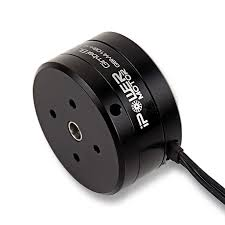](https://www.ebay.com/itm/iPower-Gimbal-Brushless-Motor-GBM4108H-120T-for-5N-7N-GH2-ILDC-Aerial-photo-FPV/254541115855?hash=item3b43d531cf:g:q94AAOSwPcVVo571) | IPower GBM4198H-120T | [Ebay](https://www.ebay.com/itm/iPower-Gimbal-Brushless-Motor-GBM4108H-120T-for-5N-7N-GH2-ILDC-Aerial-photo-FPV/252025852824?hash=item3aade95398:g:q94AAOSwPcVVo571:rk:2:pf:1&frcectupt=true) | 25$
 [](https://www.ebay.com/itm/JMT-MT3508-380KV-Motor-Disk-Motor-for-Multi-axis-Aircraft-DIY-Quadcopter-Drone/263422397574?hash=item3d5532cc86:g:31oAAOSw11BcQs6V) | GARTT ML5010 300KV | [Ebay](https://www.ebay.com/itm/GARTT-ML5010-300KV-Brushless-Motor-For-T960-T810-RC-Multirotor-Quadcopter-MT-092/302082779179?hash=item465589682b:g:h00AAOSwmfhX44X2) | 30$
 [](https://www.ebay.com/itm/Alloy-2208-90KV-Gimbal-Brushless-Motor-for-Gopro3-RC-Drone-Camera-100-200g/223195701385?hash=item33f7802089:g:cjUAAOSw1iVbyccJ) | 2208 90KV Gimbal motor | [Ebay](https://www.ebay.com/itm/Alloy-2208-90KV-Gimbal-Brushless-Motor-for-Gopro3-RC-Drone-Camera-100-200g/223195701385?hash=item33f7802089:g:cjUAAOSw1iVbyccJ) | 15$
### BLDC motor driver 
This library will be compatible with the most of the 3 phase bldc motor dirvers. Such as L6234, DRV8305 or L293. 

Examples | Description | Link | Price
---- | ---- | ---- | ---
[](https://askuric.github.io/simplefoc.html)| Arduino Simple FOC shield | [More info](https://askuric.github.io/simplefoc.html) | 35$
[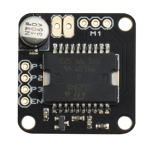](https://www.ebay.com/itm/L6234-Breakout-Board/153204519965?hash=item23abb3741d:g:LE4AAOSwe35bctgg) | Dorotek L6234 breakout board| [Drotek](https://store-drotek.com/212-brushless-gimbal-controller-l6234.html), [Ebay](https://www.ebay.fr/itm/L6234-Breakout-Board-/153204519965) | 30$
[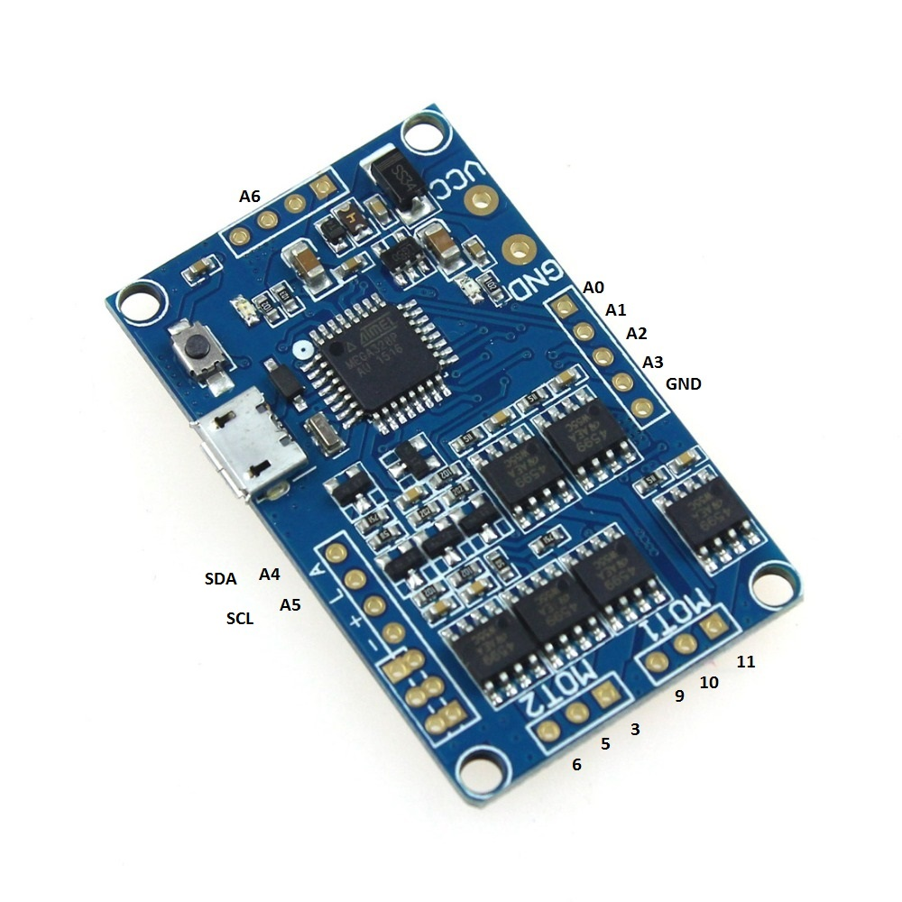](https://www.ebay.com/itm/HMBGC-V2-0-3-Axle-Gimbal-Controller-Control-Plate-Board-Module-with-Sensor/351497840990?hash=item51d6e7695e:g:BAsAAOSw0QFXBxrZ:rk:1:pf:1) | HMBGC V2.2 | [Ebay](https://www.ebay.com/itm/HMBGC-V2-0-3-Axle-Gimbal-Controller-Control-Plate-Board-Module-with-Sensor/351497840990?hash=item51d6e7695e:g:BAsAAOSw0QFXBxrZ:rk:1:pf:1) | 20$


### Position sensor
This library supports two types of position sensors: Encoder and Magnetic sensor.
#### Encoders
Encoders are by far most popular position sensors, both in industry and in hobby community. The main benefits are the precision, standardisation and very low noise level. The main problem with encoders is the code efficiency, since you need to continously count the impulses in order to have precise position.

Examples  | Description | Link | Price
---- | ---- | ---- | ----
[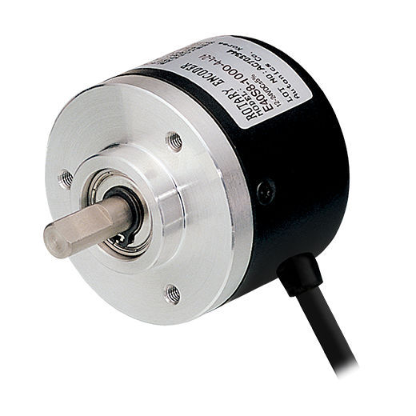](https://www.ebay.com/itm/360-600P-R-Photoelectric-Incremental-Rotary-Encoder-5V-24V-AB-Two-Phases-Shaft/254214673272?hash=item3b30601378:m:mDiuW1F2qXINSH51TqAjhTg)  | Optical encoder<br>2400cpr | [Drotek](https://store-drotek.com/212-brushless-gimbal-controller-l6234.html), [Ebay](https://www.ebay.fr/itm/L6234-Breakout-Board-/153204519965) | 10$
[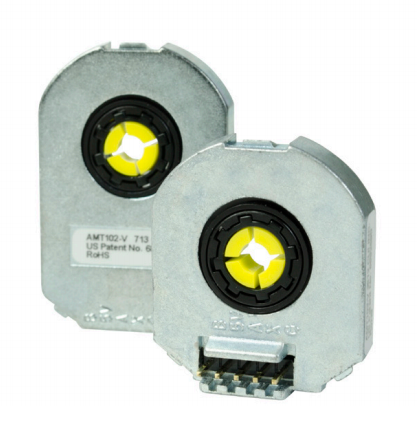](https://www.ebay.com/itm/HMBGC-V2-0-3-Axle-Gimbal-Controller-Control-Plate-Board-Module-with-Sensor/351497840990?hash=item51d6e7695e:g:BAsAAOSw0QFXBxrZ:rk:1:pf:1) | Optical encoder<br>AMT103 <br>8192cpr |  [Mouser](https://www.mouser.fr/ProductDetail/CUI-Devices/AMT103-V?qs=%2Fha2pyFaduiAsBlScvLoAWHUnKz39jAIpNPVt58AQ0PVb84dpbt53g%3D%3D)  | 20$
[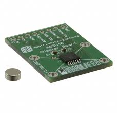](hhttps://www.mouser.fr/ProductDetail/ams/AS5X47U-TS_EK_AB?qs=sGAEpiMZZMve4%2FbfQkoj%252BBDLPCj82ZLyYIPEtADg0FE%3D) | Margetic encoder <br> AS5047U <br> 16384cpr |  [Mouser](https://www.mouser.fr/ProductDetail/ams/AS5X47U-TS_EK_AB?qs=sGAEpiMZZMve4%2FbfQkoj%252BBDLPCj82ZLyYIPEtADg0FE%3D)<br> [Youtube demo](https://www.youtube.com/watch?v=Gl-DiOqXXJ8)   | 15$

      
#### Magnetic sensors | SPI  interface
Magentic position sensor has many benefits over the encoders:
- Very efficient position calculation ( no counting ) 
- Time of execution doesn't depend on velocity or number of sensors
- No need for interrupt hardware
- Absolute position value
- Very low price
- Very simple to mount

Examples  | Description | Link | Price
---- | ---- | ---- | ----
[](https://www.mouser.fr/ProductDetail/ams/AS5X47U-TS_EK_AB?qs=sGAEpiMZZMve4%2FbfQkoj%252BBDLPCj82ZLyYIPEtADg0FE%3D) | Margetic encoder <br> AS5047<br> absolute <br>16384cpr |  [Mouser](https://www.mouser.fr/ProductDetail/ams/AS5X47U-TS_EK_AB?qs=sGAEpiMZZMve4%2FbfQkoj%252BBDLPCj82ZLyYIPEtADg0FE%3D) | 15$
[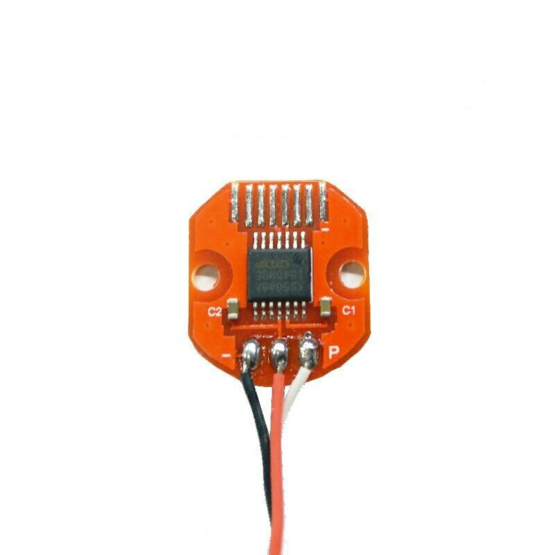](https://www.ebay.com/itm/AS5048-Magnetic-Encoder-PWM-SPI-Interface-14-Bit-Precision-For-Brushless-Motor/153636871434?hash=item23c5789d0a:g:oOMAAOSwd-5ddaWQ) | Margetic encoder <br> AS5048<br> absolute <br>16384cpr |  [Mouser](https://www.ebay.com/itm/AS5048-Magnetic-Encoder-PWM-SPI-Interface-14-Bit-Precision-For-Brushless-Motor/153636871434?hash=item23c5789d0a:g:oOMAAOSwd-5ddaWQ) | 10$

## Arduino Simple FOC Shield

At this moment we are developing an open source version of Arduin shiled specifically for FOC motor control. 
We already have prototypes of the board and we are in the testing phase. We will be coming out with the details very soon!

### Features
- Plug and play capability with the Arduino Simple FOC library
- Price in the range of \$20-\$40
- Gerber files and BOM available Open Source
- Stackable: running at least 2 motors in the same time
  
More information on this link: [Arduino Simple FOC Shield](https://askuric.github.io/simplefoc.html).

<p>    
</p>

#### Connection example
<p>
 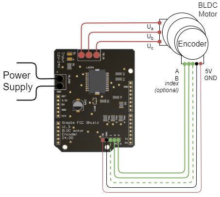
 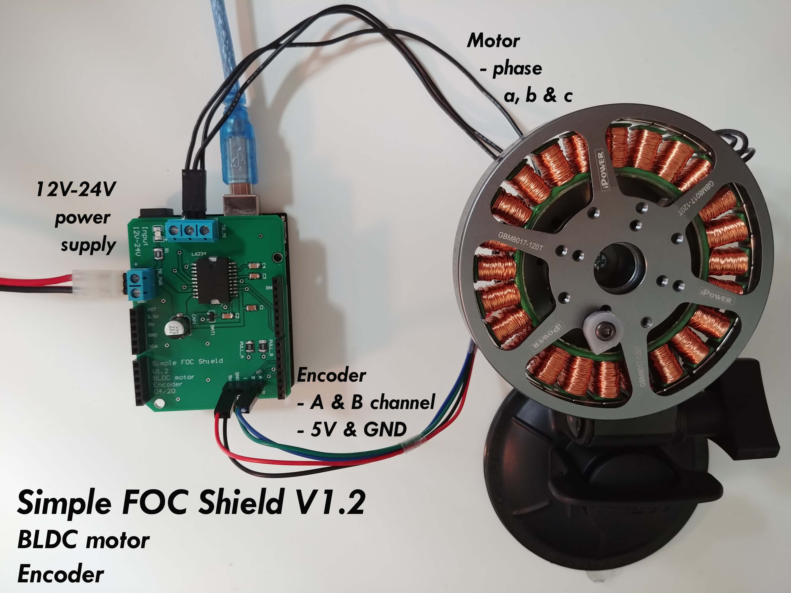
</p>

## Arduino UNO + L6234 driver
The code is simple enough to be run on Arudino Uno board. 
### Encoder as position sensor 
<p>
 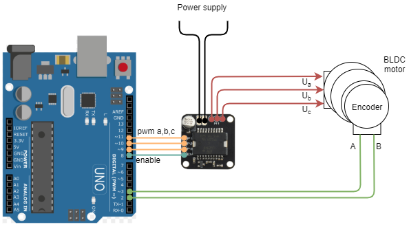
 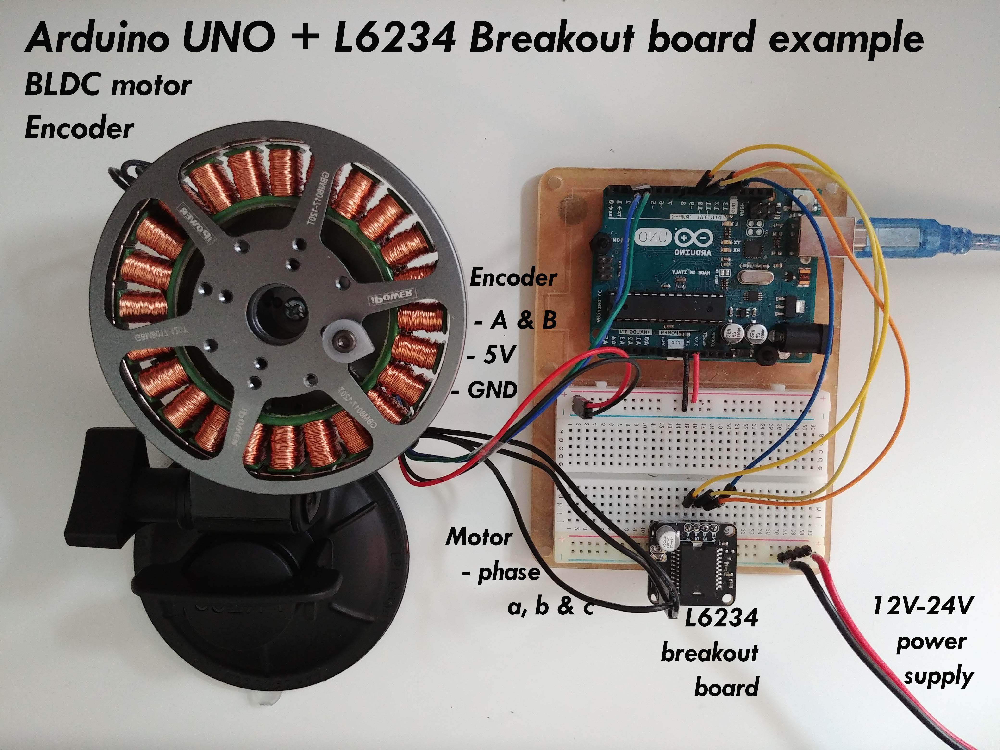
</p>  

#### Encoder
- Encoder channels `A` and `B` are connected to the Arduino's external intrrupt pins `2` and `3`. 
- Optionally if your encoder has `index` signal you can connect it to any available pin, figure shows pin `4`.
  - For Arudino UNO and similar broads which dont have 3 hardware interrupts, if you can choose, preferably connect index pin to pins `A0-A5` due to the interrupt rutine, it will have better performance (but any other pin will work as well).  
  - Othervise if you are using different board and have 3 hardware interrupt pins connect the index pin to one of them.
#### L6234 breakout board 
- Connected to the arduino pins `9`,`10` and `11` (you can use also pins `5` and `6`).  
- Additionally you can connect the `enable` pin to the any digital pin of the arduino the picture shows pin `8` but this is optional. You can connect the driver enable directly to 5v. 
- Make sure you connect the common ground of the power supply and your Arduino
#### Motor
- Motor phases `a`, `b` and `c` are connected directly to the driver outputs
- Motor phases `a`,`b`,`c` and encoder channels `A` and `B` have to be oriented right for the algorightm to work. But don't worry about it too much. Connect it in initialy as you wish and then if it doesnt move reverse pahse `a` and `b` of the motor, that should be enogh.
### Magentic sensor as position sensor 
<p>
 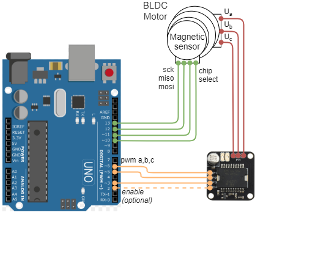
</p>  

#### Magnetic sensor
- Magnetic sensors SPI interface singals `SCK`, `MISO` and `MOSI` are connected to the Arduino's `SPI` pins (Arduino UNO `13`,`12` and `11`). 
  - If the application requires more than one sensor all of them are connected to the same pins of theArudino.
- The `chip select` pin is connected to the desired pin. Each sensor connected to the same Arduino has to have unique chip select pin.
#### L6234 breakout board 
- Connected to the arduino pins `3`,`5` and `6` (you can use also pin `9` and `10`, pin `11` is taken by the SPI interface).  
- Additionally you can connect the `enable` pin to the any digital pin of the arduino the picture shows pin `2` but this is optional. You can connect the driver enable directly to 5v. 
- Make sure you connect the common ground of the power supply and your Arduino
#### Motor
- Motor phases `a`, `b` and `c` are connected directly to the driver outputs
- Motor phases `a`,`b`,`c` and the magnetic sensor counting direciton have to be oriented right for the algorightm to work. But don't worry about it too much. Connect it initialy as you wish and then if the motor locks in place inverse `a` and `b` line of the motor.


## HMBGC V2.2
To use HMBGC controller for vector control (FOC) you need to connect motor to one of the motor terminals and connect the Encoder. The shema of connection is shown on the figures above, I also took a (very bad) picture of my setup.

<p>
	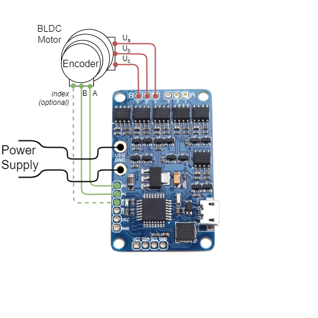
	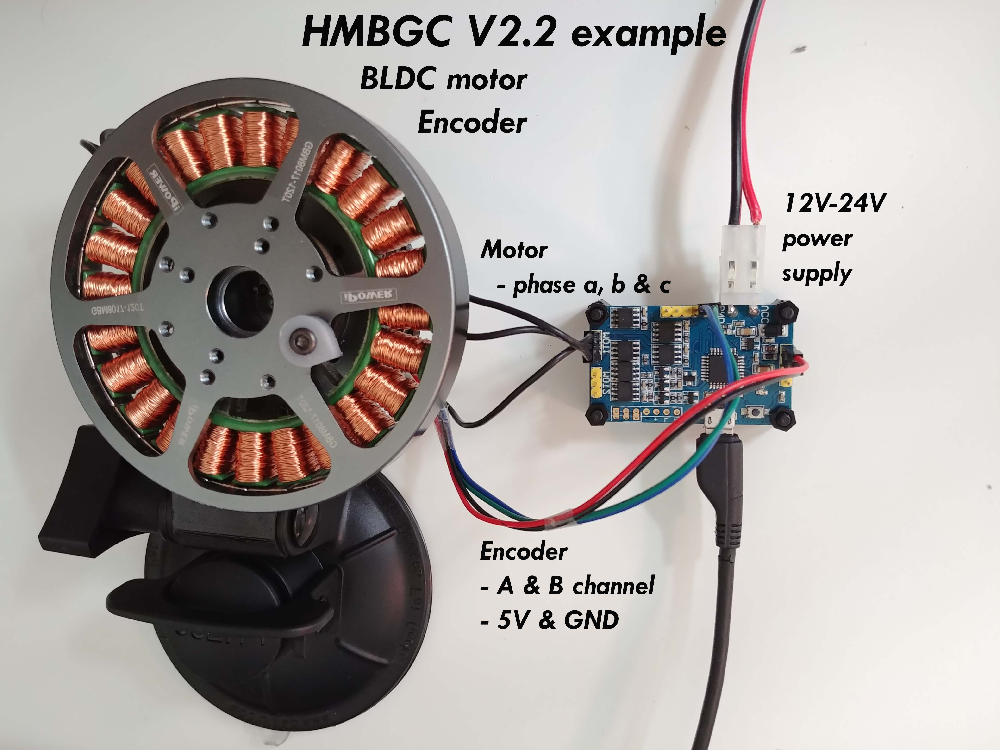
</p>
 
 
### Encoder
Since HMBGC doesn't have acces to the arduinos external interrupt pins `2` and `3` and additionally we only have acces to the analog pins, we need to read the encoder using the software interrupt. To show the functionallity we provide one example of the HMBGC code (`HMBGC_example.ino`) using the [PciManager library](https://github.com/prampec/arduino-pcimanager).

- Encoder channels `A` and `B` are connected to the pins `A0` and `A1`.
- Optionally if your encoder has `index` signal you can connect it to any available pin, figure shows pin `A2`.  
### Motor
- Motor phases `a`,`b` and `c` are connected directly to the driver outputs
- Motor phases `a`,`b`,`c` and encoder channels `A` and `B` have to be oriented right for the algorightm to work. But don't worry about it too much. Connect it in initialy as you wish and then if it doesnt move reverse pahse `a` and `b` of the motor, that should be enogh.

> HMBGC board doesn't support magnetic sensors because it doesn't have necessary SPI infrastructure.

# Arduino Simple FOC library code
The code is organised into a library. The library contains main BLDC motor class `BLDCmotor` and  two sensor classes `Endcoder` and `MagneticSensor`. `BLDCmotor` contains all the necessary FOC algorithm funcitons as well as PI controllers for the velocity and angle control.  `Encoder`  deals with the encoder interupt funcitons, calcualtes motor angle and velocity ( using the [Mixed Time Frequency Method](https://github.com/askuric/Arduino-Mixed-Time-Frequency-Method)). The `Encoder` class will support any type of otpical and magnetic encoder. `MagneticEncoder` class deals with all the necessary communication and calculation infrastructure to handle the magnetic position sensors such as AS5048 and similar. 

## Encoder setup
To initialise the encoder you need to provide the encoder `A` and `B` channel pins, encoder `PPR` and optionally `index` pin.
```cpp
//  Encoder(int encA, int encB , int cpr, int index)
//  - encA, encB    - encoder A and B pins
//  - ppr           - impulses per rotation  (cpr=ppr*4)
//  - index pin     - (optional input)
Encoder encoder = Encoder(2, 3, 8192, A0);
```
Next important feature of the encoder is enabling or disabling the `Quadrature` more. If the Encoder is run in the quadratue more its number of impulses per rotation(`PPR`) is quadrupled by detecting each `CHANGE` of the signals `A` and `B` - `CPR = 4xPPR`. In some applicaitons, when the encoder `PPR` is high it can be too much for the Arudino to handle so it is preferable not to use `Quadrature` mode. By default all the encoders use `Quadrature` mode. If you would like to enable or disable this paramter do it in the Arduino setup funciton by running:
```cpp
// check if you need internal pullups
//  Quadrature::ENABLE - CPR = 4xPPR  - default
//  Quadrature::DISABLE - CPR = PPR
encoder.quadrature = Quadrature::ENABLE;
```
Additionally the encoder has one more important parameters which is whether you want to use Arduino's internal pullup or you have external one. That is set by changing the value of the `encoder.pullup` variuable. The default value is set to `Pullup::EXTERN`
```cpp
// check if you need internal pullups
// Pullup::EXTERN - external pullup added  - dafault
// Pullup::INTERN - needs internal arduino pullup
encoder.pullup = Pullup::EXTERN;
```
### Encoder interrupt configuration
There are two ways you can run encoders with Simple FOC libtrary.
- Using Arduino hardware external interrupt - for Arduino UNO pins  `2` and `3` 
- Using software pin chnage interrupt by using a library such as [PciManager library](https://github.com/prampec/arduino-pcimanager)

> Using the hardware external interrupts usualy results in a bit better and more realible performance but software interrupts will work very good as well. 

#### Arduino Hardware external interrupt
Arduino UNO has two hadrware external interrupt pins, pin `2` and `3`. And in order to use its functionallities the encoder channels `A` and `B` will have to be connected exacly on these pins.

Simple FOC `Encoder` class already has implemented initialisation and encoder `A` and `B` channel callbacks. 
All you need to do is define two funcitons `doA()` and `doB()`, the buffering functions of encoder callback funcitons `encoder.handleA()` and `encoder.handleB()`. 
```cpp
// interrupt ruotine intialisation
void doA(){encoder.handleA();}
void doB(){encoder.handleB();}
```
And supply those functions to the encoder interrupt init fucntion `encoder.enableInterrupts()`
```cpp
// enable encoder hardware interrupts
encoder.enableInterrupts(doA, doB)
```
You can name the buffering funcitons as you wish. It is just important to supply them to the `encoder.init()` funciton. This procedure is a tradeoff in between scalability and simplicity. This allows you to have more than one encoder connected to the same arduino. All you need to do is to instantiate new `Encoder` class and create new buffer functions. For example:
```cpp
// encoder 1
Encoder enc1 =  Encoder(...);
void doA1(){enc1.handleA();}
void doB1(){enc1.handleB();}
// encoder 2
Encoder enc2 =  Encoder(...);
void doA2(){enc2.handleA();}
void doB2(){enc2.handleB();}

void setup(){
...
  enc1.init();
  enc1.enableInterrupts(doA1,doB1);
  enc2.init();
  enc2.enableInterrupts(doA2,doB2);
...
}
```

##### Index pin configuration
In order to read index pin efficienlty Simple FOC algorithm enables you to use the same approach as for the channels `A` and `B`. First you need to provide the `Encoder` class the index pin number:
```cpp
Encoder encoder = Encoder(pinA, pinB, cpr, index_pin);
```
If you are using Arduino board such as Arduino Mega and simialar and if you have more tha 2 hadrware interrupts you can connect your index pin to the hadrware interrupt pin (example Arduino Mega pin `21`). Your code will look like:
```cpp
Encoder encoder =  Encoder(2,3,600,A0);
// A and B interrupt rutine 
void doA(){encoder.handleA();}
void doB(){encoder.handleB();}
void doIndex(){encoder.handleIndex();}

void setup(){
  ...
  encoder.enableInterrupts(doA,doB,doIndex);
  ...
  }
```
The function `enableInterrupts` will handle all the intialisation for you. 
If yo are using Arduino UNO to run this algorithm and you do not have enough hardware interrupt pins you will need to use software interrupt library such as  [PciManager library](https://github.com/prampec/arduino-pcimanager). Arduino UNO code for using an encoder with index can be:
```cpp
Encoder encoder =  Encoder(2,3,600,A0);
// A and B interrupt rutine 
void doA(){encoder.handleA();}
void doB(){encoder.handleB();}
void doIndex(){encoder.handleIndex();}

// softaware interrupt listener for index pin
PciListenerImp listenerIndex(encoder.index_pin, doIndex);

void setup(){
  ...
  // hardware interrupts for A and B
  encoder.enableInterrupts(doA,doB);
  // software interrupt for index
  PciManager.registerListener(&listenerIndex);
  ...
  }
```
The same procedure can be done for pins `A` and `B` if your application makes you run out of the hardware interrupt pins. Software interrupts are very powerfull and produce very comparable results to the hardware interupts, but in general they tend to have a bit worse performance. `index` pin produces an interrupt once per rotation, therefore it is not critical, so software or hardware interrupt doesn't change too much in terms of performance. 

To explore better the encoder algorithm an example is provided `encoder_example.ino`.

#### Arduino software pin change interrupt
If you are not able to access your pins `2` and `3` of your Arduino UNO or if you want to use more than none encoder you will have to use the software interrupt approach. 
I suggest using the [PciManager library](https://github.com/prampec/arduino-pcimanager).

The stps of using this library in code are very similar to [harware interrupt](#arduino-hardware-external-interrupt).
The SimpleFOC `Encoder` class still provides you with all the callbacks `A`, `B` and `Index` channels but the Simple FOC library will not initialise the interrupts for you. 

In order to use the `PCIManager` library you will need to include it in your code:
```cpp
#include <PciManager.h>
#include <PciListenerImp.h>
```
Next step is the same as before, you will just intialise the new `Encoder` instance.
```cpp
Encoder encoder = Encoder(10, 11, 8192);
// A and B interrupt callback buffers
void doA(){encoder.handleA();}
void doB(){encoder.handleB();}
```
Then you declare listeners `PciListenerImp `:
```cpp
// encoder interrupt init
PciListenerImp listenerA(encoder.pinA, doA);
PciListenerImp listenerB(encoder.pinB, doB);
```
Finally, after running `encoder.init()` you skip the call of the `encoder.enableInterrupts()` and call the `PCIManager` library to register the interrupts for all the encoder channels.
```cpp
// initialise encoder hardware
encoder.init();
// interrupt intitialisation
PciManager.registerListener(&listenerA);
PciManager.registerListener(&listenerB);
```
And that is it, it is very simple. It if you wnat more than one encoder, you just initialise the new class instance, create the new `A` and `B` callbacks, intialise the new listeners. Here is a quick example:
```cpp
// encoder 1
Encoder enc1 =  Encoder(9, 10, 8192);
void doA1(){enc1.handleA();}
void doB1(){enc1.handleB();}
PciListenerImp listA1(enc1.pinA, doA1);
PciListenerImp listB1(enc1.pinB, doB1);

// encoder 2
Encoder enc2 =  Encoder(13, 12, 8192);
void doA2(){enc2.handleA();}
void doB2(){enc2.handleB();}
PciListenerImp listA2(enc2.pinA, doA2);
PciListenerImp listB2(enc2.pinB, doB2);

void setup(){
...
  // encoder 1
  enc1.init();
  PciManager.registerListener(&listA1);
  PciManager.registerListener(&listB1);
  // encoder 2
  enc2.init();
  PciManager.registerListener(&listA2);
  PciManager.registerListener(&listB2);
...
}
```
You can look into the `HMBGC_example.ino` ecxample to see this code in action. 
##### Index pin configuration
Enabling index pin in the case of the software interrupt is very simple. You just need to provide it to the `Encoder` class intialisation as additional parameter. 
```cpp
Encoder encoder = Encoder(pinA, pinB, cpr, index_pin);
```
Afterward you create the same type of callback buffering function as for `A` and `B` channels and using the `PCIManager` tools initialise and register the listener for the `index` channel as for the `A` and `B`. Here is a quick example:
xample:
```cpp
// class init
Encoder encoder =  Encoder(9, 10, 8192,11);
void doA(){encoder.handleA();}
void doB(){encoder.handleB();}
void doIndex(){encoder.handleIndex();}
// listeners init
PciListenerImp listenerA(encoder.pinA, doA);
PciListenerImp listenerB(encoder.pinB, doB);
PciListenerImp listenerIndex(encoder.index_pin, doIndex);

void setup(){
...
  // enable the hardware
  enc1.init();
  // enable interrupt
  PciManager.registerListener(&listenerA);
  PciManager.registerListener(&listenerB);
  PciManager.registerListener(&listenerIndex);
...
}
```
## Magnetic sensor setup
In order to use your magnetic position sensor with Simple FOC library first create an instance of the `MagneticSensor` class:
```cpp
// MagneticSensor(int cs, float _cpr, int _angle_register)
//  cs              - SPI chip select pin 
//  _cpr            - counts per revolution 
// _angle_register  - (optional) angle read register - default 0x3FFF
MagneticSensor sensor = MagneticSensor(10, 16384, 0x3FFF);
```
The parameters of the class is the `chip select` pin number you connected your sensor to, the range of your sensor (counter value for full rotation) and your `angle register` number telling the library which register value should it ask the sensor for in order to retrieve the angle value. The default `angle_register` number is set to `0x3FFF` as it is the angle register for most of the low cost AS5x4x sensors. 

Finally after the inialisalisation the only thing you need to do afterwards is to call the `init()` function. This function prepares the SPI interface and initialises the sensor hardware. So your magnetic sensor intialisation code will look like:
```cpp
MagneticSensor sensor = MagneticSensor(10, 16384, 0x3FFF);

void loop(){
  ...
  sensor.init();
  ...
}
```

If you wish to use more than one magnetic sensor, make sure you connect their `chip select` pins to different arduino pins and follow the same idea as above, here is a simple example:
```cpp
MagneticSensor sensor1 = MagneticSensor(10, 16384, 0x3FFF);
MagneticSensor sensor1 = MagneticSensor(9, 16384, 0x3FFF);

void loop(){
  ...
  sensor1.init();
  sensor2.init();
  ...
}
```

Please check the `magnetic_sensor_only_example.ino` example to see more about it.
## Motor setup
To intialise the motor you need to input the `pwm` pins, number of `pole pairs` and optionally driver `enable` pin.
```cpp
//  BLDCMotor( int phA, int phB, int phC, int pp, int en)
//  - phA, phB, phC - motor A,B,C phase pwm pins
//  - pp            - pole pair number
//  - enable pin    - (optional input)
BLDCMotor motor = BLDCMotor(9, 10, 11, 11, 8);
```
If you are not sure what your `pole_paris` number is I included an example code to estimate your `pole_paris` number in the examples `find_pole_pairs_number.ino`. I hope it helps. 

To finalise the motor setup the sensor is added to the motor and the `init` function is called.
```cpp
// link the motor to the sensor
// either Encoder class or MagenticSensor class
motor.linkSensor(&sensor);
// intialise motor
motor.init();
```


### Power supply voltage
The default  `power_supply_voltage`  value is set to `12V`. If you set your power supply to some other vlaue, chnage it here for the control loops to adapt.
```cpp
// power supply voltage
motor.power_supply_voltage = 12;
```
The `power_supply_voltage` value tells the FOC algorithm what is the maximum voltage it can output. Additioanlly since the FOC algotihm implemented in the Simple FOC library uses sinusoidal voltages the magnitudes of the sine waves exiting the Drvier circuit is going to be  `[-power_supply_voltage/2, power_supply_voltage/2]`.

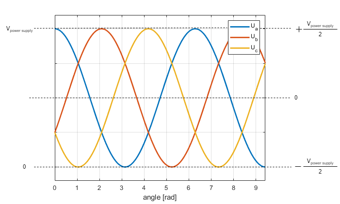


## Control loop setup
The SimpleFOC library gives you the choice of using 4 different plug and play control loops: 
- voltage control loop
- velocity control loop
- angle control loop

You set it by changing the `motor.controller` variable. If you want to control the motor angle you will set the `controller` to `ControlType::angle`, if you seek the DC motor behavior behaviour by controlling the voltage use `ControlType::voltage`, if you wish to control motor angular velocity `ControlType::velocity`. 
```cpp
// set FOC loop to be used
// ControlType::voltage
// ControlType::velocity
// ControlType::angle
motor.controller = ControlType::angle;
```
### Voltage control loop
This control loop allows you to run the BLDC motor as it is simple DC motor using Park transformation. This mode is enabled by:
```cpp
// voltage control loop
motor.controller = ControlType::voltage;
```
 <a name="foc_image"></a>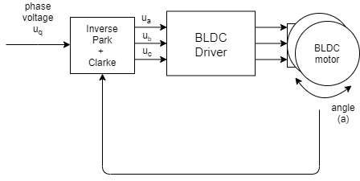

You rcan test this algoithm by running the example `voltage_control.ino`.
The FOC algorithm reads the angle <i>a</i> from the motor and sets appropriate <i>u<sub>a</sub></i>, <i>u<sub>b</sub></i> and <i>u<sub>c</sub></i> voltages such to always have <i>90 degree</i> angle in between the magnetic fields of the permanent magents in rotor and the stator. What is exaclty the principle of the DC motor.
> This control loop will give you the motor which spins freely with the velocity depending on the voltage $U_q$ you set and the disturbance it is facing. *It will turn slower if you try to hold it*.


### Velocity control loop
This control loop allows you to spin your BLDC motor with desired velocity.  This mode is enabled by:
```cpp
// velocity control loop
motor.controller = ControlType::velocity;
```

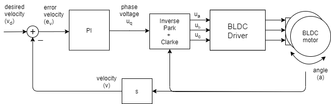

You can test this algorithm by running the example `velocity_control.ino`.
The velocity control is created by adding a PI velocity controller. This controller reads the motor velocity <i>v</i>, filteres it to <i>v<sub>f</sub></i> and sets the <i>u<sub>q</sub></i> voltage to the motor in a such maner that it reaches and maintains the target velocity <i>v<sub>d</sub></i>, set by the user. 
#### PI controller parameters
To change the parameters of your PI controller to reach desired behaiour you can change `motor.PI_velocity` structure:
```cpp
// contoller configuration based on the controll type 
// velocity PI controller parameters
// default P=0.5 I = 10
motor.PI_velocity.P = 0.2;
motor.PI_velocity.I = 20;
//defualt voltage_power_supply/2
motor.PI_velocity.voltage_limit = 6;
// jerk control using voltage voltage ramp
// default value is 300 volts per sec  ~ 0.3V per millisecond
motor.PI_velocity.voltage_ramp = 1000;

// velocity low pass filtering
// default 5ms - try different values to see what is the best. 
// the lower the less filtered
motor.LPF_velocity.Tf = 0.01;
```
The parameters of the PI controller are proportional gain `P`, integral gain `I`, voltage limit `voltage_limit`  and `voltage_ramp`. 
- The `voltage_limit` parameter is intended if, for some reason, you wish to limit the voltage that can be sent to your motor.  
- In general by raising the proportional gain `P`  your motor controller will be more reactive, but too much will make it unstable. Setting it to `0` will disable the proportional part of the controller.
- The same goes for integral gain `I` the higher it is the faster motors reaction to disturbance will be, but too large value will make it unstable. Setting it to `0` will disable the integral part of the controller.
- The `voltage_ramp` value it intended to reduce the maximal change of the voltage value which is sent to the motor. The higher the value the PI controller will be able to change faster the <i>U<sib>q</sub></i> value. The lower the value the smaller the possible change and the less responsive your controller becomes. The value of this parameter is set to be `Volts per second[V/s` or in other words how many volts can your controller raise the voltage in one time unit. If you set your `voltage_ramp` value to `10 V/s`, and on average your contol loop will run each `1ms`. Your controller will be able to chnage the <i>U<sib>q</sub></i> value each time `10[V/s]*0.001[s] = 0.01V` waht is not a lot.

Additionally, in order to smooth out the velocity measuement Simple FOC library has implemented the velocity low pass filter. [Low pass filters](https://en.wikipedia.org/wiki/Low-pass_filter) are standard form of signal smoothing, and it only has one parameter - filtering time constant `Tf`.
- The lower the value the less influence the filter has. If you put `Tf` to `0` you basically remove the filter completely. The exact `Tf` value for specific implementation is hard guess in advance, but in general the range of values of `Tf` will be somewhere form `0` to `0.5` seconds.

In order to get optimal performance you will have to fiddle a bit with with the parameters. :)

#### Control theory lovers corner :D
Transfer funciton of the PI contorller this library implements is:

<p>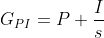</p>

Continiuos PI is discretized using Tustin transform. The final discrete equation becomes:

<p>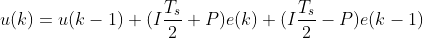</p>

Where the <i>u(k)</i> is the control signal (voltage <i>U<sub>q</sub></i> in our case) in moment <i>k</i>, <i>e(k),e(k-1)</i> is the tracking error in current moment <i>k</i> and previous step <i>k-1</i>. Tracking error presents the difference in between the target velocity value <i>v<sub>d</sub></i> and measured velocity <i>v</i>. 

<p></p>

Transfer funciton of the Low pass filter is contorller is:

<p>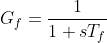</p>
In it discrete form it becomes:

<p>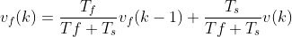</p>

where <i>v<sub>f</sub>(k)</i> is filtered velocity value in moment <i>k</i>, <i>v(k)</i> is the measured velocity in the moment <i>k</i>, <i>T<sub>f</sub></i> is the filter time constant and <i>T<sub>s</sub></i> is the sampling time (or time in between executions of the equation).
This low pass filter can be also written in the form:

<p>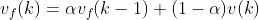</p>

where:

<p>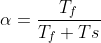</p>

This makes it a bit more clear what the time constat `Tf` of the Low pass filter stands for. If your sample time is around 1millisecond (for arduino UNO this can be taken as an average) then setting the
`Tf` value to `Tf = 0.01` will result in:

```cpp
alpha = 0.01/(0.01 + 0.001) = 0.91
```

Which means that your actual velocity measurement <i>v</i> will influence the filtered value <i>v<sub>f</sub><i> with the coeficient `1-alpha = 0.09` which is going to smooth the velocity values considerably (maybe even too muuch, depends of the application).


### Angle control loop
This control loop allows you to move your BLDC motor to the desired angle in real time.   This mode is enabled by:
```cpp
// angle control loop
motor.controller = ControlType::angle;
```

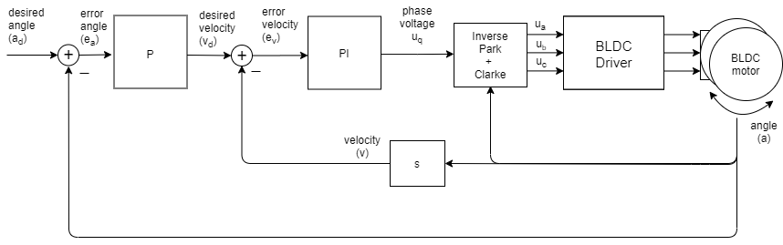

You can test this algorithm by running the example `angle_control.ino`.
The angle control loop is done by adding one more control loop in cascade on the velocity control loop like showed on the figure above. The loop is closed by using simple P controller. The controller reads the angle <i>a</i> from the motor and determins which velocity <i>v<sub>d</sub></i> the motor should move to reach desire angle <i>a<sub>d</sub></i> set by the user. And then the velocity controller reads the current filtered velocity from the motor <i>v<sub>f</sub></i> and sets the voltage <i>u<sub>q</sub></i> that is neaded to reach the velocity <i>v<sub>d</sub></i>, set by the angle loop. 

#### Controller parameters
To tune this control loop you can set the parameters to both angle P controller and velocity PI controller. 
```cpp
// contoller configuration based on the controll type 
// velocity PI controller parameters
// default P=0.5 I = 10
motor.PI_velocity.P = 0.2;
motor.PI_velocity.I = 20;
//defualt voltage_power_supply/2
motor.PI_velocity.voltage_limit = 6;
// jerk control using voltage voltage ramp
// default value is 300 volts per sec  ~ 0.3V per millisecond
motor.PI_velocity.voltage_ramp = 1000;

// velocity low pass filtering
// default 5ms - try different values to see what is the best. 
// the lower the less filtered
motor.LPF_velocity.Tf = 0.01;

// angle P controller 
// default P=20
motor.P_angle.P = 20;
//  maximal velocity of the poisiiton control
// default 20
motor.P_angle.velocity_limit = 4;
```
It is important to paramter both velocity PI and angle P controller to have the optimal performance.
The velocity PI controller is parametrisized by updating the `motor.PI_velcity` structure as expalined before. 
- Rough rule should be to lower the proportional gain `P` in order to achieve less vibrations.
- You probably wont have to touch the `I` value.
  
The angle P controller can be updated by changign the `motor.P_angle` structure. 
- Roughly proportional gain `P` will make it more responsive, but too high value will make it unstable.
  
For the angle control you will be able to see the influence of the velocity LPF filter as well. But the `Tf` value should not change much form the velocity control. So once you have it tuned for the velocity loop you can leave it as is.

Additionally you can configure the `velocity_limit` value of the controller. This value prevents the contorller to set too high velocities $v_d$ to the motor. 
- If you make your `velocity_limit` very low your motor will be moving in between desired positions with exactly this velocity. If you keep it high, you will not notice that this variable even exists. :D  

Finally, each application is a bit different and the chances are you will have to tune the controller values a bit to reach desired behaviour.


### Index search routine
Finding the encoder index is performed only if the constructor of the `Encoder` class has been provided with the `index` pin. The search is performed by setting a constant velocity of the motor until it reaches the index pin. To set the desired searching velocity alter the paramterer:
```cpp
// index search velocity - default 1rad/s
motor.index_search_velocity = 2;
```

This velocity control loop is implemented exaclty the same as [velocity control loop](#velocity-control-loop) but it has different contorller paramters which can be set by:
```cpp
// index search PI contoller parameters
// default K=0.5 Ti = 0.01
motor.PI_velocity_index_search.P = 0.1;
motor.PI_velocity_index_search.I = 0.01;
motor.PI_velocity_index_search.voltage_limit = 3;
// jerk control using voltage voltage ramp
// default value is 100 volts per sec  ~ 0.1V per millisecond
motor.PI_velocity_index_search.voltage_ramp = 300;
```
If you are having problems during the finding procedure, try tuning the PI controller constants. The same parameters as the `PI_velocity` should work well, but you can put it a bit more conservative to avoid high jumps.


## FOC routine 
### Intialisation - `setup()`
After the motor and encoder are intialised and the driver and control loops are configured you intialise the FOC algorithm. 
```cpp
// align encoder and start FOC
motor.initFOC();
```
This function aligns encoder and motor zero positions and intialises FOC variables. It is intended to be run in the `setup` function of the Arudino. After the call of this funciton FOC is ready to start following your instructions.

### Real-time execution `loop()`

The real time execution of the Arduino Simple FOC library is govenred by two funcitons `motor.loopFOC()` and `motor.move(float target)`.
```cpp
// iterative setting FOC pahse voltage
// the faster you run this funciton the better
// in arduino loop it should have ~1kHz
// the best would be to be in ~10kHz range
motor.loopFOC();
```
The funciton `loopFOC()` gets the current motor angle from the encoder, turns in into the electrical angle and computes Clarke transfrom to set the desired <i>U<sub>q</sub></i> voltage to the motor. Basically it implements the funcitonality of the [voltage control loop](#voltage-control-loop).
- The faster you can run this funciton the better 
- In the empty arduino loop it runs at ~1kHz but idealy it would be around ~10kHz


```cpp
// iterative function setting the outter loop target
// velocity, position or voltage
// this funciton can be run at much lower frequency than loopFOC funciton
// it can go as low as ~50Hz
motor.move(target);
```
The `move()` method executes the control loops of the algorihtm. If is governed by the `motor.controller` variable. It executes eigther pure voltage loop, velocity loop or angle loop.

It receives one parameter `BLDCMotor::move(float target)` which is current user define target value.
- If the user runs [velocity loop](#velocity-control-loop), `move` funciton will interpret `target` as the target velocity <i>v<sub>d</sub></i>.
- If the user runs [angle loop](#angle-control-loop), `move` will interpret `target` parameter as the target angle<i>a<sub>d</sub></i>. 
- If the user runs the [voltage loop](#voltage-control-loop), `move` funciton will interpret the `target` parameter as voltage <i>u<sub>d</sub></i>.


> At this point because we are oriented to simplicity we did not implement synchornious version of this code. Uing timer interrupt. The main reason for the moment is that Arduino UNO doesn't have enough timers to run it. 
> *But in future we are planning to include this functionality.*

## Examples
Examples folder structure
```shell
│ examples
│   ├─── encoder examples             # EXMAPLES OF ENCODER APPLICATIONS
│   │   ├───angle_control                   # example of angle control loop with configuraiton
│   │   ├───change_direction                # simple motor changing velocity direction in real time
│   │   ├───encoder_example                 # simple example of encoder usage
│   │   ├───find_pole_pairs_number          # simple code example estimating pole pair number of the motor
│   │   ├───HMBGC_example                   # example of code to be used with HMBGC controller with
│   │   ├───velocity_control                # example of velocity control loop with configuraiton
│   │   ├───voltage_control                 # example of the voltage control loop with configuraiton
│   │   └───velocity_PI_tuning              # code example of tuning velcity controller by using serial terminal
│   │
│   └─── magnetic sensor examples      # EXMAPLES OF MAGENETIC SENSOR APPLICATIONS AS5047/48
│       ├───angle_control                   # example of angle control loop with configuraiton
│       ├───change_direction                # simple motor changing velocity direction in real time
│       ├───find_pole_pairs_number          # simple code example estimating pole pair number of the motor
│       ├───magnetic_sensor_only_example    # simple example of magnetic sensor usage
│       ├───velocity_control                # example of velocity control loop with configuraiton
│       ├───voltage_control                 # example of the voltage control loop with configuraiton
│       └───velocity_PI_tuning              # code example of tuning velcity controller by using serial terminal
```
## Simple FOC library source structure:
```shell
│ src
│ │
│ ├─ SimpleFOC.h               # SimpleFOC library include file
│ │   
│ ├─ BLDCMotor.cpp/h           # BLDCMotor class implementing all the FOC operations
│ │ 
│ ├─ Sensor.h                  # Abstract Sensor class that all the sensors implement
│ ├─ Encoder.cpp/h             # Enocder class implementing the Quadrature encoder operations
│ ├─ MagneticSensor.cpp/h      # class implementing SPI angle read and interface for AS5047/8 type sensors
│ │ 
│ └─ FOCutils.cpp/h            # Utility functions 
```


# Debugging

`BLDCMotor` clsss supports debugging using `Serial` port which is enabled by:
```cpp
motor.useDebugging(Serial);
```
before running `motor.init()`.
The class will output its status during the intialisation of the motor and the FOC. Enabling tyhe debugger will not directly influence the real-time performance. By default the class will stop its debugging output once it goes to the main loop.

To debug control loop exection in the examples we added a funciton `motor.monitor()` which log the motor variables to the serial port. The funciton logs different variables based for differenc control loops.
```cpp
// utility function intended to be used with serial plotter to monitor motor variables
// significantly slowing the execution down!!!!
void BLDCMotor::monitor() {
  if(!debugger) return;
  switch (controller) {
    case ControlType::velocity:
      debugger->print(voltage_q);
      debugger->print("\t");
      debugger->print(shaft_velocity_sp);
      debugger->print("\t");
      debugger->println(shaft_velocity);
      break;
    case ControlType::angle:
      debugger->print(voltage_q);
      debugger->print("\t");
      debugger->print(shaft_angle_sp);
      debugger->print("\t");
      debugger->println(shaft_angle);
      break;
    case ControlType::voltage:
      debugger->print(voltage_q);
      debugger->print("\t");
      debugger->print(shaft_angle);
      debugger->print("\t");
      debugger->println(shaft_velocity);
      break;
  }
}
```
The intention of this method is to be called in main loop funciton along the `loopFOC()` and `move()` funciton. Thsi funciton is going to impaire the execution perfomance and reduce the sampling frequency so therefore take it in consideration when running the code. 

If you wish to implement you own debugging functions or just output the motor variables to the `Serial` terminal here are the public varaibles of the `BLDCMotor` class.


```cpp

class BLDCMotor
{
  public:
  ...
    // current motor angle
    float shaft_angle;
    // current motor velocity 
    float shaft_velocity;
    // current target velocity
    float shaft_velocity_sp;
    // current target angle
    float shaft_angle_sp;
    // current voltage u_q set
    float voltage_q;
...
}
```
Additionally it is possible to use encoder api directly to get the encoder angle and velocity. 
```cpp

class Encoder{
 public:
    // shaft velocity getter
    float getVelocity();
	// shaft angle getter
    float getAngle();
}
```
As well as magnetic sensor's api, to get the sensor's angle and velocity. 
```cpp

class MagneticSensor{
 public:
    // shaft velocity getter
    float getVelocity();
	// shaft angle getter
    float getAngle();
}
```

# Work Roadmap
## Future work
- [ ] Proper introduction of the **Arudino FOC Shield V1.2**
- [ ] Publish a video tutorial fir using the library and the samples  
  - [x] Initial video with simple demonstration
  - [ ] Coding setup and procedure video
  - [ ] Two motors running on HMBGC example
  - [ ] ....
- [ ] Implement Space Vector Modulation method 
  -  [ ] Pure SVM
  -  [ ] PWM SVM
- [ ] Implement support for MOSFET control low and high pairs

## Work in progress
- [x] Make the library accesible in the Arduino Library Manager 
- [x] Make minimal version of the arduino code - all in one arduino file
- [x] Encoder index proper implementation
- [x] Enable more dirver types 
- [x] Make support for magnetic encoder AS5048 ABI
- [x] Make support for magnetic encoder AS5048 SPI
- [x] Add support for acceleration ramping
- [x] Velocity Low pass filter
- [x] Timer interrupt execution rather than in the `loop()`
  - FAIL: Perfromance not improved
- [x] Sine wave lookup table implementation

# Contact
Please do not hesitate to leave an issue or contact me direclty by email.
I will be very happy to hear your experiences.
antun.skuric@outlook.com

Additionally you can find some updates on the website:
[askuric.github.io](https://askuric.github.io)