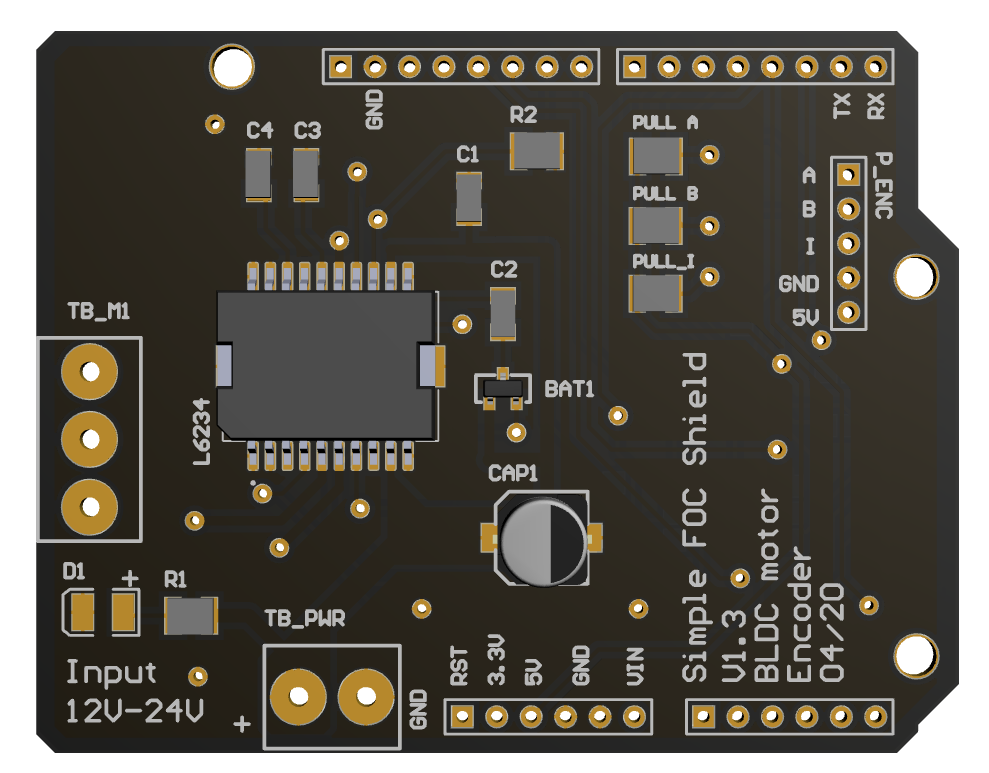
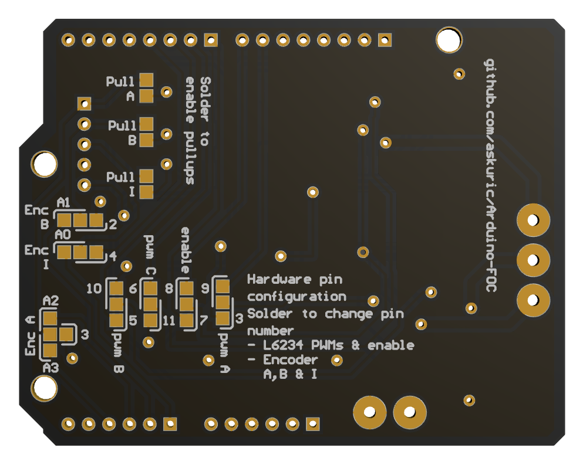
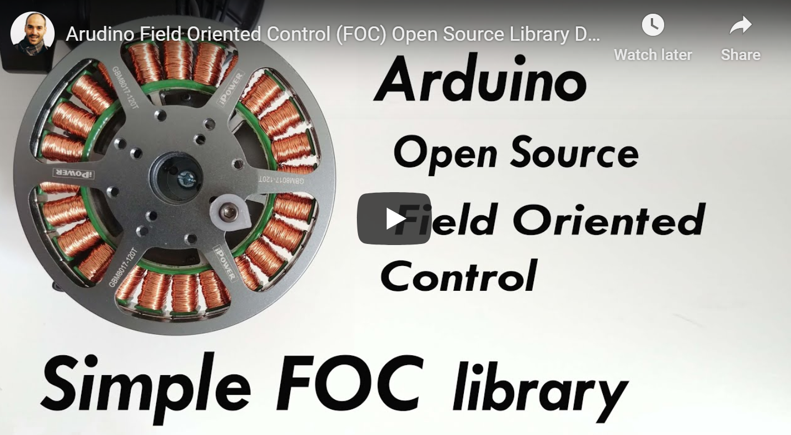

# Arduino Simple Field Oriented Control (FOC) library 

Proper low cost FOC supporting boards are very hard to find these days and even may not exist. The reason may be that the hobby community has not yet dug into it properly. But even if you would find a hardware which is capable of runing BLDC motors, a good FOC code capable of running on Arduino devices is even harder to find. Therefore this is the attempt to ***demistify the Field Oriented Control (FOC) algorithm*** and make a ***robust but simple implementation*** for ***Arduino hadrware***, as well as to introduce the new [Arduino FOC shield board](https://askuric.github.io/simplefoc.html).

    

### Features
- Plug and play capability with the Arduino Simple FOC library
- Price in the range of \$20-\$40
- Gerber files and BOM available Open Source
- Stackable: running at least 2 motors in the same time

##### If you are interested in this board, find more information on this link: [Arduino Simple FOC Shield](https://askuric.github.io/simplefoc.html)

## A short library YouTube demonstration video

This video explains the Simple FOC library basic usage, electronic connections and demonstrates its capabilities.

### This project aims to close the gap in the areas:
- Low cost applications <50$
- Low current operation < 5A
- Simple usage and scalability (Arduino) 
  - Plug and play arduino library for beginers
  - Arudino minimal code for easy integration and customisation for different advanced projects
- Introducing [Arduino FOC shield board](#arduino-simple-foc-shield)  

#### The closest you can get to FOC support and low cost (I was able to find) is:

<a href="https://odriverobotics.com/" >Odroid</a> | <a href="https://www.youtube.com/watch?v=g2BHEdvW9bU">Trinamic</a> | <a href="https://www.infineon.com/cms/en/product/evaluation-boards/bldc_shield_tle9879/" >Infineon</a> | <a href="https://github.com/gouldpa/FOC-Arduino-Brushless">FOC-Arduino-Brushless</a>
------------ | ------------- | ------------ | -------------
 |  | | 
:heavy_check_mark: Open Source | :x: Open Source | :x: Open Source | :heavy_check_mark: Open Source
:heavy_check_mark:Simple to use | :heavy_check_mark: Simple to use | :heavy_check_mark:Simple to use | :x: Simple to use
:x: Low cost ($100) | :x: Low cost ($100) | :heavy_check_mark:Low cost ($40) | :heavy_check_mark: Low cost
:x: Low power (>50A) | :heavy_check_mark: Low power  | :heavy_check_mark:  Low power | :heavy_check_mark: Low power

## Arduino FOC repo structure
Branch  | Description | Status
------------ | ------------- | ------------ 
[master](https://github.com/askuric/Arduino-FOC) | Stable and tested library version | 
[dev](https://github.com/askuric/Arduino-FOC/tree/dev) | Developement library version | 
[minimal](https://github.com/askuric/Arduino-FOC/tree/minimal) | Minimal Arduino example with integrated library | 

# Contents
- [Installation](#arduino-simple-foc-instalation)
  - [Installing the full Arduino Simple FOC library](#installing-simple-foc-full-library)
  - [Installing the minimal Arduino example](#download-simple-foc-arduino-minimal-example)
- [Electrical connecitons and schematic](#electrical-connections)
  - [Minimal setup](#all-you-need-for-this-project)
  - [Arduino Simple FOC Shield](#arduino-simple-foc-shield)
  - [Arduino UNO + L6234 driver](#arduino-uno-l6234-driver)
  - [HMBGC gimbal contorller example](#hmbgc-v22)
- [Code explanation and examples](#arduino-simple-foc-library-code)
  - [Encoder setup](#encoder-setup)
  - [Magentic sensor setup](#magnetic-sensor-setup)
  - [BLDC motor setup](#motor-setup)
  - [Control loop setup](#control-loop-setup)
    - [Voltage control loop](#voltage-control-loop)
    - [Velcoity control loop](#velocity-control-loop)
    - [Angle control loop](#angle-control-loop)
  - [Debugging practice](#debugging)
- [Future work and work in progress](#work-roadmap)
- [Contact](#contact)

# Work Roadmap
## Future work
- [ ] Proper introduction of the **Arudino FOC Shield V1.2**
- [ ] Publish a video tutorial fir using the library and the samples  
  - [x] Initial video with simple demonstration
  - [ ] Coding setup and procedure video
  - [ ] Two motors running on HMBGC example
  - [ ] ....
- [ ] Implement Space Vector Modulation method 
  -  [ ] Pure SVM
  -  [ ] PWM SVM
- [ ] Implement support for MOSFET control low and high pairs

## Work in progress
- [x] Make the library accesible in the Arduino Library Manager 
- [x] Make minimal version of the arduino code - all in one arduino file
- [x] Encoder index proper implementation
- [x] Enable more dirver types 
- [x] Make support for magnetic encoder AS5048 ABI
- [x] Make support for magnetic encoder AS5048 SPI
- [x] Add support for acceleration ramping
- [x] Velocity Low pass filter
- [x] Timer interrupt execution rather than in the `loop()`
  - FAIL: Perfromance not improved
- [x] Sine wave lookup table implementation