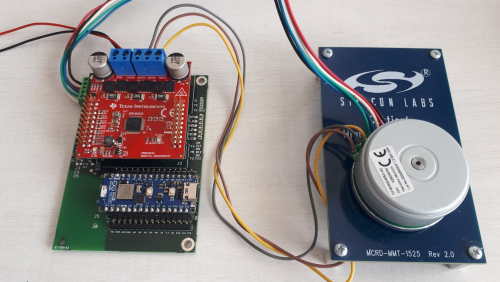

# Silabs Hardware-Specific Examples for SimpleFOC

This folder contains **hardware-specific example projects** for running the [SimpleFOC](https://docs.simplefoc.com/) library on **Silicon Labs EFR32 microcontrollers** (tested on Arduino Nano Matter). Each example demonstrates a motor control use case using a **6PWM BLDC driver**.

**Example List**

- **efr32_hall_sensor_velocity_6pwm**
  - Demonstrates velocity control of a BLDC motor using a Hall sensor for feedback and a 6PWM driver on an EFR32 board.

- **efr32_open_loop_velocity_6pwm**
  - Shows how to run a BLDC motor in open-loop velocity mode (no sensor feedback) using a 6PWM driver on EFR32.

- **efr32_torque_velocity_6pwm**
  - Example of torque and velocity control for a BLDC motor using a 6PWM driver on EFR32, suitable for advanced control scenarios.

## Hardware Setup

Required hardware:

* **Arduino Nano Matter (EFR32MG24)** [https://docs.arduino.cc/hardware/nano-matter/](https://docs.arduino.cc/hardware/nano-matter/)
* **DRV8305 BoosterPack (BOOSTXL-DRV8305EVM)**
* **BLDC Motor: DF45M024053 – A2**
* USB cable for programming and serial monitor

A dedicated interface board set-up connecting the Motor - Power Stage - Nano Matter. Jump wires can be used as well to connect the boards.



Connect the Arduino Nano Matter board to the DRV8305EVM according to the board pin mapping (phase outputs, PWM inputs, and Hall sensor connections).


### Wiring Table: Arduino Nano Matter to BOOSTXL-DRV8305 & BLDC Motor

This table describes the connections between the Arduino Nano Matter, the TI BOOSTXL-DRV8305 driver board, and a 3-phase BLDC motor with Hall sensors.

| From (Nano Matter Pin) | To (DRV8305 BoosterPack Pin) | BLDC MOTOR | Function / Description | 
| :--- | :--- | :--- | :---|
| `3.3V` | `3V3` | HALL/ENC Supply*  | 3.3V Power the BoosterPack provides 3.3V through an LDO |
| `GND` | `PowerSupply GND` | HALL/ENC sensor GND | Common Ground |
| N/A | `PowerSupply 12V` | N/A | Power supply for power stage 4.4 to 45 V, consider motor power|
| `A0`  | `ISENA` | N/A | Phase A current sense |
| `A1`  | `ISENB` | N/A | Phase B current sense |
| `A2`  | `ISENC` | N/A | Phase C current sense |
| `A3`  | `VSENA` | N/A | Phase A Voltage sense (Optional, not mandatory to run examples) |
| `A4`  | `VSENB` | N/A | Phase B Voltage sense (Optional, not mandatory to run examples) |
| `A5`  | `VSENC` | N/A | Phase C Voltage sense (Optional, not mandatory to run examples)|
| `A6`  | `VSENVPVDD`   | N/A | DC BUS Voltage sense (Optional, not mandatory to run examples)|
| `D0` (MOSI1)  | `SDI` | N/A | DRV8035 SPI connection, configuration and status reading (Optional, not mandatory to run examples)|
| `D1` (MISO1)  | `SDO` | N/A | DRV8035 SPI connection, configuration and status reading (Optional, not mandatory to run examples)|
| `D2` (SCK1)   | `SCLK`| N/A | DRV8035 SPI clock, configuration and status reading (Optional, not mandatory to run examples)|
| `D3` (SS1)    | `SCS` | N/A | DRV8035 SPI chip select, configuration and status reading (Optional, not mandatory to run examples)|
| `D4`  | N/A | HALL A or Encoder A | Motor sensor connection (Hall configuration in examples) |
| `D5`  | N/A | HALL B or Encoder B | Motor sensor connection (Hall configuration in examples) |
| `D6`  | `PWMHA` | N/A | PWM Phase A High-Side Gate Signal |
| `D7`  | `PWMLA` | N/A | PWM Phase A Low-Side Gate Signal |
| `D8`  | `PWMHB` | N/A | PWM Phase B High-Side Gate Signal |
| `D9`  | `PWMLB` | N/A | PWM Phase B Low-Side Gate Signal |
| `D10` | `PWMHC` | N/A | PWM Phase C High-Side Gate Signal |
| `D11` | `PWMLC` | N/A | PWM Phase C Low-Side Gate Signal |
| `D12` | `ENGATE` | N/A | Enable DRV8305 gate driver |
| `D13` | N/A | HALL C or Encoder Index | Motor sensor connection (Hall configuration in examples) |
| N/A | `PHASE U` | `PHASE U` | Motor phase connection |
| N/A | `PHASE V` | `PHASE V` | Motor phase connection |
| N/A | `PHASE W` | `PHASE W` | Motor phase connection |

**Important Notes:**
*   **Power:** Ensure the DRV8305's `PVDD` and `GVDD` jumpers are correctly set for your motor's voltage. The power supply should be rated at least twice the motor’s nominal power. The BoosterPack can supply the Nano Matter if it is not connected to USB.
* **Rotor sensor:** Some Encoder or Hall sensors might require 5V supply, make sure of proper level shifting if required. 
*   **SPI:** The SPI connection (`nSCS`, `SPI_CLK`, `SPI_MOSI`, `SPI_MISO`) is used to configure the DRV8305 driver IC (e.g., set gain, fault parameters). It is optional for the examples. The examples are using the default gate driver configuration. Only needed if you wish to change the default gate driver configuration (e.g., dead time, fault parameters).

---

## Software Setup

1. **Arduino IDE**

   * Use Arduino IDE **2.3.4 or later**.
   * [Download here](https://www.arduino.cc/en/software).

2. **Silicon Labs Arduino Core**

   * Open *Boards Manager* in Arduino IDE.
   * Search for *Silicon Labs* and install the latest version (**2.3.0** or newer).
   * If not found, add this URL under *Preferences → Additional Boards Manager URLs*:

     ```
     https://siliconlabs.github.io/arduino/package_arduinosilabs_index.json
     ```

3. **SimpleFOC (Silabs-modified version)**

    * Open *Library Manager* in Arduino IDE.
    * Search and add *Simple FOC* library

4. **(Optional) SimpleFOC Studio or web viewer**

   * For runtime tuning and monitoring.
   * [Docs](https://docs.simplefoc.com/studio)
   * [Enable Monitoring](https://docs.simplefoc.com/monitoring)

---

## Running the Examples

1. Open the `.ino` file in Arduino IDE.
2. Select your **Arduino Nano Matter** board.
3. Compile & upload.
4. Open the Serial Monitor (115200 baud)
5. (Optional) Connect with monitoring tools. 
    1. Modification of the example code is necessary to enable monitoring feature.
    2. [Enable Monitoring](https://docs.simplefoc.com/monitoring)

### Example Commands

Send commands to control the motor:

``` bash
M50    # Run clockwise at 50 rad/s
M-50   # Run counter-clockwise at 50 rad/s
M0     # Stop motor
```

---

## Notes on EFR32 Porting

The EFR32 port of SimpleFOC includes:

* Full **6PWM driver support** (deadtime insertion, duty cycle updates).
* **Current sense integration** (low-side sensing tested).
* **Arduino-style pin mapping** for portability.

---

## References

* [SimpleFOC Documentation](https://docs.simplefoc.com/)
* [Commander Interface](https://docs.simplefoc.com/commander_interface)
* [Arduino Nano Matter Manual](https://docs.arduino.cc/tutorials/nano-matter/user-manual/)
* [Silicon Labs Arduino Core](https://github.com/SiliconLabs/arduino)
* [SimpleFOC Studio](https://github.com/JorgeMaker/SimpleFOCStudio)


